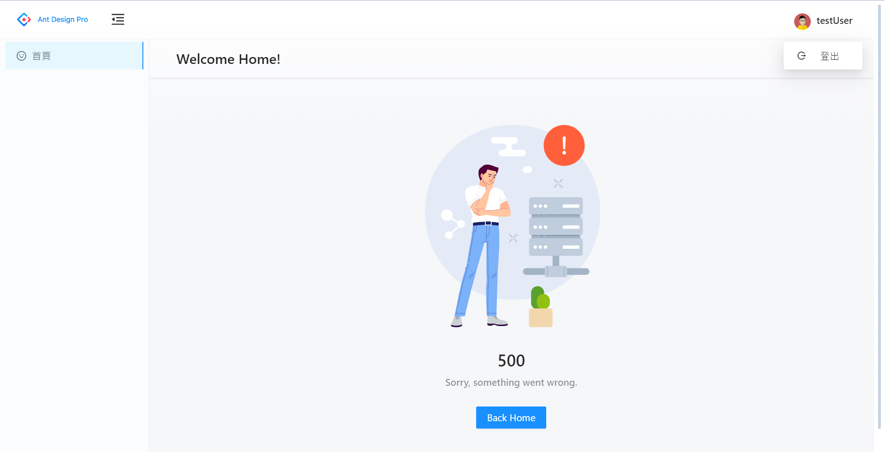

# antd-sidebar-menu-template
使用 antd 與 antd pro 實現側邊欄選單模板(尚無多國語系設定)



## 📔 技術與工具
- Presentation
  - React v18
  - Ant Design
  - styled-components
  - vitjs/vit: 處理頁面 router 管理，為了使 Ant Design Pro 相容於 vite 環境，採用配置式路由與基於路由分割程式碼處理頁面導向邏輯
  - Redux-Toolkit
  - Redux-Saga: redux middleware
  - axios-mock-adapter: 用於在測試期間模擬 Axios 請求
- Unit Test
  - Jest
  - jest-html-reporters: 將測試結果產生可視化報表
- Bundle
  - Vite 

## 🔨 開發

1. 安裝套件包並執行專案

```cmd
npm i && npm run dev
```

> 開啟新視窗

```cmd
http://localhost:8080
```

## 📤 上版

1. 開發完畢 commit 至 remote 前，請注意先執行 eslint & formatter 確保格式正確
   > commit message 格式請符合此[規範](https://wadehuanglearning.blogspot.com/2019/05/commit-commit-commit-why-what-commit.html)

```cmd
npm run format
npm run lint (如出現錯誤，可執行後綴 :fix 搭配使用)
```

1. 確認測試腳本是否都通過

> 執行腳本並開啟測試結果的可視化報表

```cmd
npm run test
```

## 📦 打包

```cmd
npm run build
```

## 🔍 預覽打包內容

在本地啟用一個靜態 Web server，預先檢查打包的內容是否可以正常使用，以免正式部署出現錯誤。

```cmd
npm run serve
```

> 開啟新視窗

```cmd
http://localhost:4173
```
